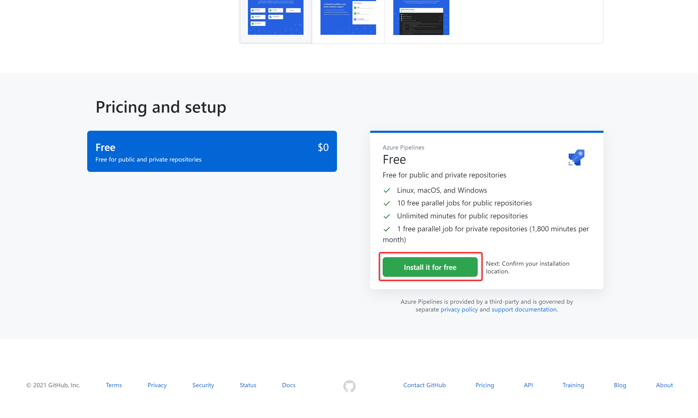
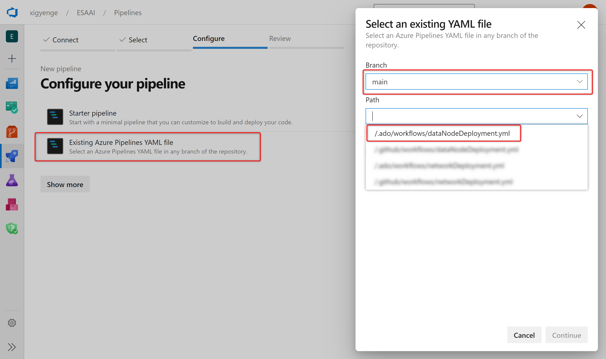

# Enterprise Scale Analytics - Data Product: Analytics & Data Science

> **General disclaimer** Please be aware that this template is in public preview. Therefore, expect smaller bugs and issues when working with the solution. Please submit an Issue in GitHub if you come across any issues that you would like us to fix.

# Description

**Enterprise Scale Analytics** emphasizes self-service and follows the concept of creating landing zones for cross-functional teams. Operation and responsibility of these landing zones is handed over to the responsible teams inside the data node. The teams are free to deploy their own services within the guardrails set by Azure Policy. To scale across the landing zones more quickly and allow a shorter time to market, we use the concept of Data Domain and Data Product templates. `Data Domain` and `Data Product` templates are blueprints, which can be used to quickly spin up environments for these cross-functional teams. The teams can fork these repos to quickly spin up environments based on their requirements. This Data Product template deploys a set of services, which can be used for data analytics and data science. The template includes tools such as Azure Machine Learning, Cognitive Services and Azure Search, which allows the teams to choose their tools based on their requirements and preferences.

## What will be deployed?

By default, all the services which come under Data Product Analytics are enabled, and you must explicitly disable services that you don't want to be deployed.

> Note: Before deploying the resources, we recommend to check registration status of the required resource providers in your subscription. For more information, see [Resource providers for Azure services](https://docs.microsoft.com/en-us/azure/azure-resource-manager/management/resource-providers-and-types).

<p align="center">
    
</p>

For each Data Product Analytics template, the following services are created:
 - [Key Vault](https://docs.microsoft.com/en-us/azure/key-vault/general)
 - [Data Factory](https://docs.microsoft.com/en-us/azure/data-factory/)
 - [Cognitive Services](https://azure.microsoft.com/en-us/services/cognitive-services/)
 - [Synapse Workspace](https://docs.microsoft.com/en-us/azure/synapse-analytics/)
 - [Azure Search](https://azure.microsoft.com/en-us/services/search/)
 - [Application Insights](https://docs.microsoft.com/en-us/azure/azure-monitor/app/app-insights-overview)
 - [Machine Learning](https://azure.microsoft.com/en-us/services/machine-learning/)
 - [Container Registry](https://azure.microsoft.com/en-us/services/container-registry/)
 - [SQL Pool](https://docs.microsoft.com/en-us/azure/synapse-analytics/sql-data-warehouse/sql-data-warehouse-overview-what-is)
 - [SQL Server](https://docs.microsoft.com/en-us/sql/sql-server/?view=sql-server-ver15)
 - [Storage](https://azure.microsoft.com/en-us/services/storage/)
 - [BigData Pool](https://docs.microsoft.com/en-us/sql/big-data-cluster/concept-data-pool?view=sql-server-ver15)

For more details regarding the services that will be deployed, please read the [Products](https://github.com/Azure/Enterprise-Scale-Analytics/blob/main/docs/03-datalandingzones/06-dataproducts.md) guide in the Enterprise Scale Analytics documentation.

You have two options for deploying this reference architecture:
1. Use the `Deploy to Azure` button for an immediate deployment
2. Use GitHub Actions or Azure DevOps Pipelines for an automated, repeatable deployment

# Prerequisites

The following prerequisites are required to make this repository work:
* A resource group within an Azure subscription
* [User Access Administrator](https://docs.microsoft.com/en-us/azure/role-based-access-control/built-in-roles#user-access-administrator) or [Owner](https://docs.microsoft.com/en-us/azure/role-based-access-control/built-in-roles#owner) access to a resource group to be able to create a service principal and role assignments for it.
* You need to request a [private DNS quota increase for Machine Learning](https://docs.microsoft.com/en-us/azure/machine-learning/how-to-manage-quotas#private-endpoint-and-private-dns-quota-increases).
* Access to a subnet with `privateEndpointNetworkPolicies` and `privateLinkServiceNetworkPolicies` set to disabled. The Data Landing Zone deployment already creates a few subnets with this configuration.

If you don’t have an Azure subscription, [create your Azure free account today](https://azure.microsoft.com/en-us/free/).

# Option 1: Deploy to Azure - Quickstart

| &nbsp;Data Product Analytics |
|:---------------------|
[](https%3A%2F%2Fraw.githubusercontent.com%2FAzure%2Fdata-product-analytics%2Fmain%2Fdocs%2Freference%2Fdeploy.dataProduct.json)

# Option 2: GitHub Actions or Azure DevOps Pipelines

## 1. Create repository from a template

1. On GitHub, navigate to the main page of this repository.
2. Above the file list, click **Use this template**

<p align="center">
  
</p>

3. Use the **Owner** drop-down menu and select the account you want to own the repository.
<p align="center">
  
</p>

4. Type a name for your repository and an optional description.
5. Choose a repository visibility. For more information, see "[About repository visibility](https://docs.github.com/en/github/creating-cloning-and-archiving-repositories/about-repository-visibility)."
6. Optionally, to include the directory structure and files from all branches in the template and not just the default branch, select **Include all branches**.
7. Click **Create repository from template**.

## 2. Setting up the required Service Principal

A service principal needs to be generated for authentication and authorization from GitHub or Azure DevOps to your Azure subscription. This is required to deploy resources to your environment. Just go to the `Azure Portal` to find the ID of your subscription. Then start Azure CLI or PowerShell, login to Azure, set the Azure context and execute the following commands to generate the required credentials:

> NOTE: The purpose of this new Service Principal is to assign least-privilege rights. Therefore, it requires the **Contributor** role at a resource group scope in order to deploy the resources inside the resource group dedicated to a specific data product. The **Network Contributor** role assignment is required as well in this repository in order to assign the resources to the dedicated subnet.

**Azure CLI**
```Shell
# Replace {service-principal-name} and {subscription-id} with your 
# Azure subscription id and any name for your service principal.
az ad sp create-for-rbac \
  --name "{service-principal-name}" \
  --role "Contributor" \
  --scopes "/subscriptions/{subscription-id}" \
  --sdk-auth
```

This will generate the following JSON output:
```JSON
{
  "clientId": "<GUID>",
  "clientSecret": "<GUID>",
  "subscriptionId": "<GUID>",
  "tenantId": "<GUID>",
  (...)
}
```

**Take note of the output. It will be required for the next steps.**

A few more role assignments are required for this service principal in order to be able to successfully deploy all services. Required role assignments include:

| Role Name | Description | Scope |
|:----------|:------------|:------|
| [Private DNS Zone Contributor](https://docs.microsoft.com/en-us/azure/role-based-access-control/built-in-roles#private-dns-zone-contributor) | We expect you to deploy all Private DNS Zones for all data services into a single subscription and resource group. The service principal needs to be Private DNS Zone Contributor on that resource group. This is required to deploy A-records for the respective private endpoints.&nbsp;&nbsp;&nbsp;&nbsp;&nbsp;&nbsp;&nbsp;&nbsp;&nbsp;&nbsp;&nbsp;&nbsp;&nbsp;&nbsp;&nbsp;&nbsp;&nbsp;&nbsp;&nbsp;&nbsp;&nbsp;&nbsp;&nbsp;&nbsp;&nbsp;&nbsp;&nbsp;&nbsp;&nbsp;&nbsp;&nbsp;&nbsp;&nbsp;&nbsp;&nbsp;&nbsp;&nbsp;&nbsp;&nbsp;&nbsp;&nbsp;&nbsp;&nbsp;&nbsp;&nbsp;&nbsp;&nbsp;&nbsp;&nbsp;&nbsp;&nbsp;&nbsp;&nbsp;&nbsp;&nbsp;&nbsp;&nbsp;&nbsp;&nbsp;&nbsp;&nbsp;&nbsp;&nbsp;&nbsp;&nbsp;&nbsp;&nbsp;&nbsp;&nbsp;&nbsp;&nbsp;&nbsp;&nbsp;&nbsp;&nbsp;&nbsp;&nbsp;&nbsp;&nbsp;&nbsp;&nbsp;&nbsp;&nbsp;&nbsp;&nbsp;&nbsp;&nbsp;&nbsp;&nbsp;&nbsp;&nbsp;&nbsp;&nbsp;&nbsp;&nbsp;&nbsp;&nbsp; | (Resource Group Scope) `/subscriptions/{subscriptionId}/resourceGroups/{resourceGroupName}` |
| [Contributor](https://docs.microsoft.com/en-us/azure/role-based-access-control/built-in-roles#contributor) | We expect you to deploy all data-product-analytics services into a single resource group within the Data Landing Zone subscription. The service principal requires a **Contributor** role-assignment on that resource group. &nbsp;&nbsp;&nbsp;&nbsp;&nbsp;&nbsp;&nbsp;&nbsp;&nbsp;&nbsp;&nbsp;&nbsp;&nbsp;&nbsp;&nbsp;&nbsp;&nbsp;&nbsp;&nbsp;&nbsp;&nbsp;&nbsp;&nbsp;&nbsp;&nbsp;&nbsp;&nbsp;&nbsp;&nbsp;&nbsp;&nbsp;&nbsp;&nbsp;&nbsp;&nbsp;&nbsp;&nbsp;&nbsp;&nbsp;&nbsp;&nbsp;&nbsp;&nbsp;&nbsp;&nbsp;&nbsp;&nbsp;&nbsp;&nbsp;&nbsp;&nbsp;&nbsp;&nbsp;&nbsp;&nbsp;&nbsp;&nbsp;&nbsp;&nbsp;&nbsp;&nbsp;&nbsp;&nbsp;&nbsp;&nbsp;&nbsp;&nbsp;&nbsp;&nbsp;&nbsp;&nbsp;&nbsp;&nbsp;&nbsp;&nbsp;&nbsp;&nbsp;&nbsp;&nbsp;&nbsp;&nbsp;&nbsp;&nbsp;&nbsp;&nbsp;&nbsp;&nbsp;&nbsp;&nbsp;&nbsp;&nbsp;&nbsp;&nbsp;&nbsp;&nbsp;&nbsp;&nbsp; | (Resource Group Scope)  `/subscriptions/{subscriptionId}/resourceGroups/{resourceGroupName}` |
| [Network Contributor](https://docs.microsoft.com/en-us/azure/role-based-access-control/built-in-roles#network-contributor) | In order to deploy Private Endpoints to the specified subnet, the service principal requires **Network Contributor** access on the subnet. | (Child-Resource Scope) `/subscriptions/{subscriptionId}/resourceGroups/{resourceGroupName} /providers/Microsoft.Network/virtualNetworks/{virtualNetworkName}/subnets/{subnetName}"` |

&nbsp;&nbsp;&nbsp;&nbsp;&nbsp;&nbsp;&nbsp;&nbsp;&nbsp;&nbsp;

To add these role assignments, you can use the [Azure Portal](https://portal.azure.com/) or run the following commands:

**Azure CLI**
```Shell
# Get Service Principal Object ID
az ad sp list --display-name "{servicePrincipalName}" --query "[].{objectId:objectId}" --output tsv

# Add role assignment
# 1. Resource Scope
az role assignment create \
  --assignee "{servicePrincipalObjectId}" \
  --role "{roleName}" \
  --scopes "{scope}"

# 2. Resource group Scope
az role assignment create \
  --assignee "{servicePrincipalObjectId}" \
  --role "{roleName}" \
  --resource-group "{resourceGroupName}"

# 3. Child-Resource Scope
# TBD
```

**Azure Powershell**
```Powershell
# Get Service Principal Object ID
$spObjectId = (Get-AzADServicePrincipal -DisplayName "{servicePrincipalName}").id

# Add role assignment
# 1. Resource Scope
New-AzRoleAssignment `
  -ObjectId $spObjectId `
  -RoleDefinitionName "{roleName}" `
  -Scope "{scope}"

# 2. Resource group Scope
New-AzRoleAssignment `
  -ObjectId $spObjectId `
  -RoleDefinitionName "{roleName}" `
  -ResourceGroupName "{resourceGroupName}"

# 3. Child-Resource Scope
New-AzRoleAssignment `
  -ObjectId $spObjectId `
  -RoleDefinitionName "{roleName}" `
  -ResourceName "{subnetName}" `
  -ResourceType "Microsoft.Network/virtualNetworks/subnets" `
  -ParentResource "virtualNetworks/{virtualNetworkName}" `
  -ResourceGroupName "{resourceGroupName}
``` 

Now you can choose whether you would like to use GitHub Actions or Azure DevOps for your deployment.

## 3. a) GitHub Actions

If you want to use GitHub Actions for deploying the resources, add the previous JSON output as a [repository secret](https://docs.github.com/en/actions/reference/encrypted-secrets#creating-encrypted-secrets-for-a-repository) with the name `AZURE_CREDENTIALS` in your GitHub repository:

<p align="center">
  
</p>

To do so, execute the following steps:

1. On GitHub, navigate to the main page of the repository.
2. Under your repository name, click on the **Settings** tab.
3. In the left sidebar, click **Secrets**.
4. Click **New repository secret**.
5. Type the name `AZURE_CREDENTIALS` for your secret in the Name input box.
6. Enter the JSON output from above as value for your secret.
7. Click **Add secret**.

## 3. b) Azure DevOps

If you want to use Azure DevOps Pipelines for deploying the resources, you need to create an Azure Resource Manager service connection. To do so, execute the following steps:

1. First, you need to create an Azure DevOps Project. Instructions can be found [here](https://docs.microsoft.com/en-us/azure/devops/organizations/projects/create-project?view=azure-devops&tabs=preview-page).
2. In Azure DevOps, open the **Project settings**.
3. Now, select the **Service connections** page from the project settings page.
4. Choose **New service connection** and select **Azure Resource Manager**.

<p align="center">
  
</p>

5. On the next page select **Service principal (manual)**.
6. Select the appropriate environment to which you would like to deploy the templates. Only the default option **Azure Cloud** is currently supported.
7. For the **Scope Level**, select **Subscription** and enter your `subscription Id` and `name`.
8. Enter the details of the service principal that we have generated in step 3. (**Service Principal Id** = **clientId**, **Service Principal Key** = **clientSecret**, **Tenant ID** = **tenantId**) and click on **Verify** to make sure that the connection works.
9. Enter a user-friendly **Connection name** to use when referring to this service connection. Take note of the name because this will be required in the parameter update process. 
10. Optionally, enter a **Description**.
11. Click on **Verify and save**.

<p align="center">
  
</p>

More information can be found [here](https://docs.microsoft.com/en-us/azure/devops/pipelines/library/connect-to-azure?view=azure-devops#create-an-azure-resource-manager-service-connection-with-an-existing-service-principal).

## 4. Parameter Update Process

In order to deploy the ARM templates in this repository to the desired Azure subscription, you will need to modify some parameters in the forked repository. As updating each parameter file manually is a time-consuming and potentially error-prone process, we have simplified the task with a GitHub Action workflow. After successfully executing the previous steps, please open the <a href="/.github/workflows/updateParameters.yml">`/.github/workflows/updateParameters.yml` YAML file</a>. In this file you need to update the environment variables. Just click on <a href="/.github/workflows/updateParameters.yml">`/.github/workflows/updateParameters.yml`</a> and edit the following section: 


```YAML
env:
  GLOBAL_DNS_RESOURCE_GROUP_ID: '/subscriptions/{subscriptionId}/resourceGroups/{resourceGroupName}'
  DATA_LANDING_ZONE_SUBSCRIPTION_ID: '{dataLandingZoneSubscriptionId}'
  DATA_LANDING_ZONE_NAME: '{dataLandingZoneName}' # Choose max. 11 characters. They will be used as a prefix for all services. If not unique, deployment can fail for some services.
  LOCATION: '{regionName}'                        # Specifies the region for all services (e.g. 'northeurope', 'eastus', etc.)
  SUBNET_ID: '/subscriptions/{subscriptionId}/resourceGroups/{resourceGroupName}/providers/Microsoft.Network/virtualNetworks/{vnetName}/subnets/{subnetName}'
  ML_COMPUTE_INSTANCE_USER_OBJECT_ID: '{mlComputeInstanceObjectId}'
  DATABRICKS_WORKSPACE_ID: '{databricksWorkspaceId}'
  SYNAPSE_STORAGE_ACCOUNT_NAME: '{synapseStorageAccountName}'
  SYNAPSE_STORAGE_ACCOUNT_FILE_SYSTEM_NAME: '{synapseStorageAccountFileSystemName}'
  AZURE_RESOURCE_MANAGER_CONNECTION_NAME: '{resourceManagerConnectionName}'

```

The following table explains each of the parameters:
| Parameter                                | Description  | Sample value |
|:-----------------------------------------|:-------------|:-------------|
| **GLOBAL_DNS_RESOURCE_GROUP_ID**             | Specifies the global DNS resource group resource ID which gets deployed with the [Data Management Landing Zone](https://github.com/Azure/data-management-zone) &nbsp;&nbsp;&nbsp;&nbsp;&nbsp;&nbsp;&nbsp;&nbsp;&nbsp;&nbsp;&nbsp;&nbsp;&nbsp;&nbsp;&nbsp;&nbsp;&nbsp;&nbsp;&nbsp;&nbsp;&nbsp;&nbsp;&nbsp;&nbsp;&nbsp;&nbsp;&nbsp;&nbsp;&nbsp;&nbsp;&nbsp;&nbsp;&nbsp;&nbsp;&nbsp;&nbsp;&nbsp;&nbsp;&nbsp;&nbsp;&nbsp;&nbsp;&nbsp;&nbsp;&nbsp;&nbsp;&nbsp;&nbsp;&nbsp;&nbsp;&nbsp;&nbsp;&nbsp;&nbsp;&nbsp;&nbsp;&nbsp;&nbsp;&nbsp;&nbsp;&nbsp;&nbsp;&nbsp;&nbsp;&nbsp;&nbsp;&nbsp;&nbsp;&nbsp;&nbsp;&nbsp;&nbsp;&nbsp;&nbsp;&nbsp;&nbsp;&nbsp;&nbsp;&nbsp;&nbsp;&nbsp;&nbsp;&nbsp;&nbsp;&nbsp;&nbsp;&nbsp;&nbsp;&nbsp;&nbsp;&nbsp;&nbsp;&nbsp;&nbsp;&nbsp;&nbsp;&nbsp;&nbsp;&nbsp;&nbsp;&nbsp;&nbsp;&nbsp;&nbsp;&nbsp;&nbsp;&nbsp;&nbsp;&nbsp;&nbsp;&nbsp;&nbsp;&nbsp;&nbsp;&nbsp;&nbsp;&nbsp;&nbsp;&nbsp;&nbsp;&nbsp;&nbsp;&nbsp;&nbsp;&nbsp;&nbsp;&nbsp;&nbsp;&nbsp;&nbsp;&nbsp;&nbsp;&nbsp;&nbsp;&nbsp;&nbsp;&nbsp;&nbsp; | `/subscriptions/xxxxxxxx-xxxx-xxxx-xxxx-xxxxxxxxxxxx/resourceGroups/my-resource-group` |
| **DATA_LANDING_ZONE_SUBSCRIPTION_ID**        | Specifies the subscription ID of the Data Landing Zone where all the resources will be deployed | `xxxxxxxx-xxxx-xxxx-xxxx-xxxxxxxxxxxx` |
| **DATA_LANDING_ZONE_NAME**                   | Specifies the name of your Data Landing Zone. The value should consist of alphanumeric characters (A-Z, a-z, 0-9) and should not contain any special characters like `-`, `_`, `.`, etc. Special characters will be removed in the renaming process. | `mynode01` |
| **LOCATION**                                 | Specifies the region where you want the resources to be deployed. | `northeurope` |
| **SUBNET_ID**                              | Specifies the resource ID of the dedicated subnet which was created during the Data Landing Zone deployment. | `/subscriptions/xxxxxxxx-xxxx-xxxx-xxxx-xxxxxxxxxxxx/resourceGroups/my-network-rg/providers/Microsoft.Network/virtualNetworks/my-vnet/subnets/mysubnet` |
| **ML_COMPUTE_INSTANCE_USER_OBJECT_ID** |
| **DATABRICKS_WORKSPACE_ID** |
|**SYNAPSE_STORAGE_ACCOUNT_NAME**| Specifies the name of the Azure Synapse Storage Account | `synapsestorageaccount`
|**SYNAPSE_STORAGE_ACCOUNT_FILE_SYSTEM_NAME**| Specifies the name of the Synapse Account filesystem| `fs`| 
| **AZURE_RESOURCE_MANAGER_CONNECTION_NAME**   | Specifies the resource manager connection name in Azure DevOps. You can leave the default value if you want to use GitHub Actions for your deployment. More details on how to create the resource manager connection in Azure DevOps can be found in step 4. b) or [here](https://docs.microsoft.com/en-us/azure/devops/pipelines/library/connect-to-azure?view=azure-devops#create-an-azure-resource-manager-service-connection-with-an-existing-service-principal). | `my-connection-name` |


&nbsp;&nbsp;&nbsp;&nbsp;&nbsp;&nbsp;&nbsp;&nbsp;&nbsp;&nbsp;&nbsp;&nbsp;

After updating the values, please commit the updated version to the `main` branch of your repository. This will kick off a GitHub Action workflow, which will appear under the **Actions** tab of the main page of the repository. The `Update Parameter Files` workflow will update all parameters in your repository according to a certain naming convention. Once the process has finished, it will open a new pull request in your repository, where you can review the changes made by the workflow. Please follow the instructions in the pull request to complete the parameter update process. The instructions will guide towards the following steps: 
  - create a new `resource group` where all the resources specific to this Data Domain Batch will be deployed;
  - add the required role assignments for the Service Principal created at step **2. Setting up the required Service Principal**;
  - change the environment variables in the deployment workflow file

>Note: We are not renaming the environment variables in the workflow files because this could lead to an infinite loop of workflow runs being started.

After following the instructions in the pull request, you can merge the pull request back into the `main` branch of your repository by clicking on **Merge pull request**. Finally, you can click on **Delete branch** to clean up your repository.

## 5. (not applicable for GH Actions) Reference pipeline from GitHub repository in Azure DevOps Pipelines

### A. Install Azure DevOps Pipelines GitHub Application

First you need to add and install the Azure Pipelines GitHub App to your GitHub account. To do so, execute the following steps:

1. Click on **Marketplace** in the top navigation bar on GitHub.
2. In the Marketplace, search for **Azure Pipelines**. The Azure Pipelines offering is free for anyone to use for public repositories and free for a single build queue if you’re using a private repository.

<p align="center">
  
</p>

4. Select it and click on **Install it for free**.

<p align="center">
  
</p>

5. If you are part of multiple **GitHub** organizations, you may need to use the **Switch billing account** dropdown to select the one into which you forked this repository.
6. You may be prompted to confirm your GitHub password to continue. 
7. You may be prompted to log in to your Microsoft account. Make sure you log in with the one that is associated with your Azure DevOps account.

### B. Configuring the Azure Pipelines project

As a last step, you need to create an Azure DevOps pipeline in your project based on the pipeline definition YAML file that is stored in your GitHub repository. To do so, execute the following steps:

1. Select the Azure DevOps project where you have setup your `Resource Manager Connection`.
2. Select **Pipelines** and then **New Pipeline** in order to create a new pipeline.

<p align="center">
  
</p>
 
3. Choose **GitHub YAML** and search for your repository (e.g. "`GitHubUserName/RepositoryName`").

<p align="center">
  
</p>

4. Select your repository.
4. Click on **Existing Azure Pipelines in YAML file**
6. Select `main` as branch and `/.ado/workflows/dataNodeDeployment.yml` as path.

<p align="center">
  
</p>

7. Click on **Continue** and then on **Run**.

## 6. Follow the workflow deployment

**Congratulations!** You have successfully executed all steps to deploy the template into your environment through GitHub Actions or Azure DevOps.

If you are using GitHub Actions, you can navigate to the **Actions** tab of the main page of the repository, where you will see a workflow with the name `Data Product Deployment` running. Click on it to see how it deploys one service after another. If you run into any issues, please open an issue [here](https://github.com/Azure/data-landing-zone/issues).

If you are using Azure DevOps Pipelines, you can navigate to the pipeline that you have created as part of step 6 and monitor it as each service is deployed. If you run into any issues, please open an issue [here](https://github.com/Azure/data-landing-zone/issues).

# Enterprise Scale Analytics Documentation and Implementation

- [Documentation](https://github.com/Azure/Enterprise-Scale-Analytics)
- [Implementation - Data Management](https://github.com/Azure/data-management-zone)
- [Implementation - Data Landing Zone](https://github.com/Azure/data-landing-zone)
- [Implementation - Data Domain - Batch](https://github.com/Azure/data-domain-batch)
- [Implementation - Data Domain - Streaming](https://github.com/Azure/data-domain-streaming)
- [Implementation - Data Product - Reporting](https://github.com/Azure/data-product-reporting)
- [Implementation - Data Product - Analytics & Data Science](https://github.com/Azure/data-product-analytics)


## Known issues

### Error: MissingSubscriptionRegistration

**Error Message:**

```sh
ERROR: Deployment failed. Correlation ID: ***
  "error": ***
    "code": "MissingSubscriptionRegistration",
    "message": "The subscription is not registered to use namespace 'Microsoft.DocumentDB'. See https://aka.ms/rps-not-found for how to register subscriptions.",
    "details": [
      ***
        "code": "MissingSubscriptionRegistration",
        "target": "Microsoft.DocumentDB",
        "message": "The subscription is not registered to use namespace 'Microsoft.DocumentDB'. See https://aka.ms/rps-not-found for how to register subscriptions."
 
```
**Solution:**

This error message appears, in case during the deployment it tries to create a type of resource which has never been deployed before inside the subscription. We recommend to check prior the deployment whether the required resource providers are registered for your subscription and if needed, register them through the `Azure Portal`, `Azure Powershell` or `Azure CLI` as mentioned [here](https://docs.microsoft.com/en-us/azure/azure-resource-manager/management/resource-providers-and-types).


# Contributing

This project welcomes contributions and suggestions.  Most contributions require you to agree to a
Contributor License Agreement (CLA) declaring that you have the right to, and actually do, grant us
the rights to use your contribution. For details, visit https://cla.opensource.microsoft.com.

When you submit a pull request, a CLA bot will automatically determine whether you need to provide
a CLA and decorate the PR appropriately (e.g., status check, comment). Simply follow the instructions
provided by the bot. You will only need to do this once across all repos using our CLA.

This project has adopted the [Microsoft Open Source Code of Conduct](https://opensource.microsoft.com/codeofconduct/).
For more information see the [Code of Conduct FAQ](https://opensource.microsoft.com/codeofconduct/faq/) or
contact [opencode@microsoft.com](mailto:opencode@microsoft.com) with any additional questions or comments.
